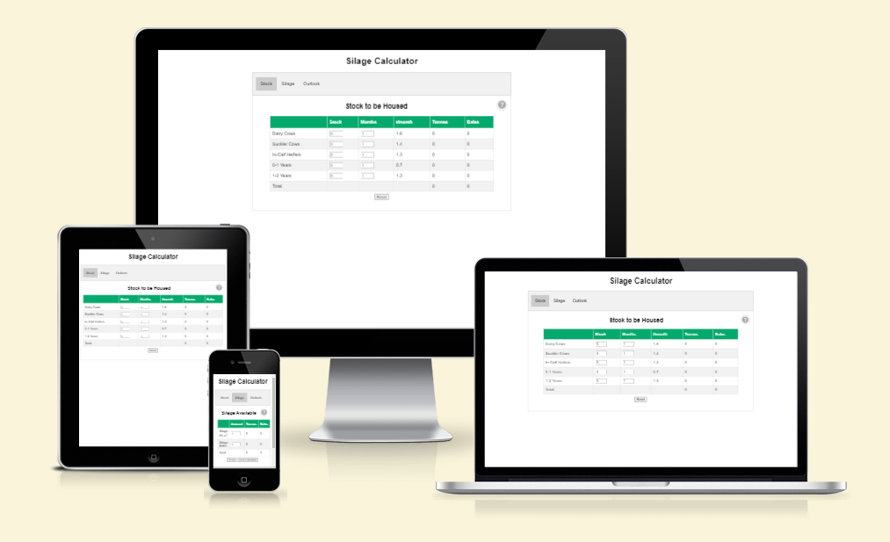
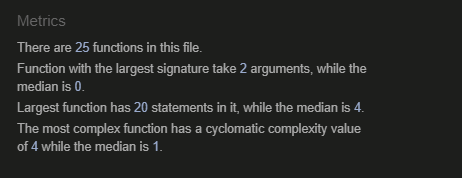

# Silage Calculator

Silage Calculator is a winter feed budget tool to help farmers ensure that they have an appropriate stock of silage feed for the comming winter. While it is most important that a farm has enough feed for the cattle housed over the winter it is also important not to carry too much more than required, as silage has a limited storage life especially in the form of bales. This tool can aid in planning of what additional feed will be required or if cattle or silage should be bought / sold to avoid wastage.

The link to the live site can be found here - [Silage Calculator](https://farmer-eds-shed.github.io/Silage-Calculator/)

## Features

- **Stock to be Housed**

  - Calculates the total silage requirment for cattle by type/age in both tonnes and bales.

- **Silage Available**

  - Enter all silage available to the farm in m3 and/or bales and calculate total available in bales and tonnes.
  - Optional, includes a calculator to work out silage pit in m3.

- **Winter Outlook**

  - Produces a report showing silage required, silage available and any surplus/deficit.
  - Optional, a report can be exported as a PDF.

- **Graph**
  - A graph is updated whenever silage or stock numbers are modified to show current stock levels.

### Features Left to Implement

## User Stories

### Farmer A.
  - Has a surplus of silage, navigates to the Silage tab first and enters silage amount.
  - Then navigates to Stock tab to see how many adittional cattle can be purchased.
  - The graph at the bottom of the screen updates, allowing the farmer experiment with different cattle numbers.

### Farmer B. 
  - Has a silage deficit, navigates to the Stock tab first and enters current cattle numbers.
  - Then goes to the Silage tab and enters current silage available in the pit and bales.
  - Finaly the farmer navigates to the Outlook tab and produces a PDF report as a record of how much extra silage is required.

## Testing

### Validator Testing

- HTML
  - No errors were returned when passing through the official [W3C validator](https://validator.w3.org/nu/?doc=https%3A%2F%2Ffarmer-eds-shed.github.io%2FSilage-Calculator%2F)
- CSS
  - No errors were found when passing through the official [(Jigsaw) validator](https://jigsaw.w3.org/css-validator/validator?uri=https%3A%2F%2Ffarmer-eds-shed.github.io%2FSilage-Calculator%2F&profile=css3svg&usermedium=all&warning=1&vextwarning=&lang=en)
- JavaScript
  - No errors were found when passing through the official [Jshint validator](https://jshint.com/)
    - The following metrics were returned:

### Lighthouse

### Responsive Site Testing
- Site was tested with various screen sizes using [Responsinator.com](http://www.responsinator.com/?url=https%3A%2F%2Ffarmer-eds-shed.github.io%2FSilage-Calculator%2F)
- Physical testing also carried out on an OPPO A54 with view port 360px x 664px
- And a PC with viewport of 1440px x 749px

### Manual Testung

### Fixed Bugs

- Graph displaying negative numbers on scale when stock and silage values are zero.
  - This was a limitation of the google charts library, the solution was to hide the chart until a value greater than zero was to be displayed.
- PDF not displaying input box values.
  - This was a limitation of the jsPDF-Autotable library when auto generating tables from HTML, the solution was to build an array from the table values before generating the PDF. see [Issue 804](https://github.com/simonbengtsson/jsPDF-AutoTable/issues/804)
- Input box focus issue, calculation method not being called when input updated using arrow buttons on number inputs.
  - Solution was to use 'change' instead of 'focus out on event listener.
- Input validation issue, negative numbers and exponents.
  - Solution was to use 'keypress' on an event listener with 'RegExp("^[0-9]+$")'

## Deployment

- The site was deployed to GitHub pages. The steps to deploy are as follows:
  - In the GitHub repository, navigate to the Settings tab.
  - Choose Pages from left-hand menu.
  - From the source section drop-down menu, select deploy from a branch.
  - From the branch section drop-down menu, select main and save.
  - The page will be automatically refreshed with a detailed ribbon display to indicate the successful deployment.

The live link can be found here - https://farmer-eds-shed.github.io/Silage-Calculator/

## Credits

## General Code

- [W3Schools](https://www.w3schools.com/howto/howto_js_tabs.asp) - Tabs.
- [Stack Overflow](https://stackoverflow.com/questions/31706611/why-does-the-html-input-with-type-number-allow-the-letter-e-to-be-entered-in#:~:text=HTML%20input%20number%20type%20allows,thank%20you%20for%20the%20question.) - Input validation for positive Integers.

### Libraries used

- [Google Charts](https://developers.google.com/chart#:~:text=Google%20chart%20tools%20are%20powerful,interactive%20charts%20and%20data%20tools.)
- [jsPDF](https://github.com/parallax/jsPDF)
- [jsPDF-Autotable](https://github.com/simonbengtsson/jsPDF-AutoTable)

### Other Acknowlegements

- **Mentor** Antonio Rodriguez
